# PrestaShop Security Hardening Lab and Vulnerability Assessment
> Security hardening and vulnerability assessment of a PrestaShop 9.1.0 e-commerce application hosted on Apache in a Kali Linux lab environment.

## Overview

This project documents the security hardening and vulnerability assessment performed on a PrestaShop 9.1.0 e-commerce application hosted on an Apache web server. The objective was to improve the application's security posture by implementing security best practices, reducing the attack surface, validating secure configurations, and simulating attacks against administrative and application components.

## Project Screenshot

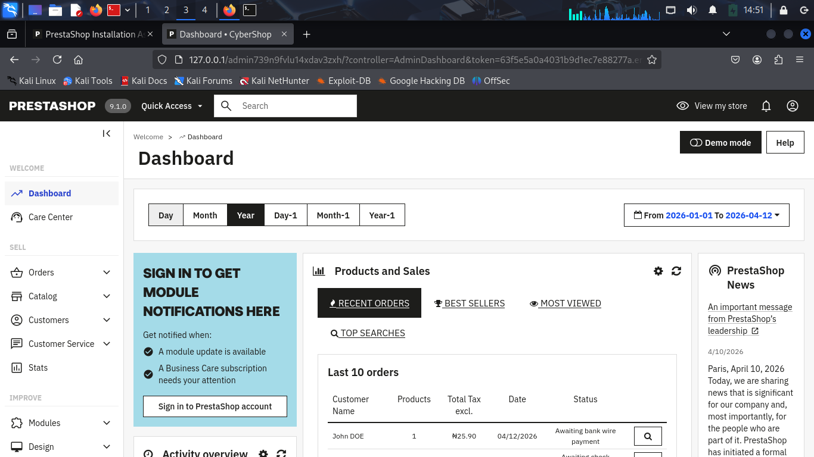

## Table of Contents

- [Overview](#overview)
- [Environment](#environment)
- [Security Hardening Checklist](#security-hardening-checklist)
- [Methodology](#methodology)
- [Attack Simulation](#attack-simulation)
- [Evidence Collected](#evidence-collected)
- [Logs Reviewed](#logs-reviewed)
- [Mitigation Measures Implemented](#mitigation-measures-implemented)
- [Security Controls Summary](#security-controls-summary)
- [Skills Demonstrated](#skills-demonstrated)
- [Conclusion](#conclusion)

---

## Environment

| Component | Details |
|------------|------------|
| Operating System | Kali Linux |
| Web Server | Apache |
| Application | PrestaShop 9.1.0 |
| Database | MySQL/MariaDB |
| Target | 127.0.0.1 |
| Protocols Tested | HTTP (80), HTTPS (443) |

## Lab Architecture

The assessment was conducted in a controlled Kali Linux lab environment.

### Components

- Kali Linux (Attacker/Assessment Machine)
- Apache Web Server
- PrestaShop 9.1.0
- MySQL/MariaDB Database
- HTTPS/TLS Enabled
- Localhost Testing Environment (127.0.0.1)

### Security Controls Implemented

- Strong Administrator Password
- Secure File Permissions
- HTTPS Enforcement
- Secure Session Cookies
- Administrative Path Obfuscation
- IP-Based Access Restrictions
- Module Hardening
- Backup Verification

## Key Achievements

- Updated and secured PrestaShop 9.1.0 modules
- Removed default accounts and sample data
- Hardened administrator authentication
- Enforced secure session cookie settings
- Enabled and verified HTTPS/TLS
- Protected administrative access paths
- Reduced attack surface by disabling unnecessary modules
- Verified backup and recovery procedures

---

## Security Hardening Checklist

### 1. Application and Module Updates

**Status:** ✅ Implemented

- Verified the installed PrestaShop version (9.1.0).
- Reviewed available module updates.
- Updated outdated modules to the latest versions.
- Confirmed no pending update notifications remained.

#### Evidence

**PrestaShop Version Verification**


**Module Successfully Updated**

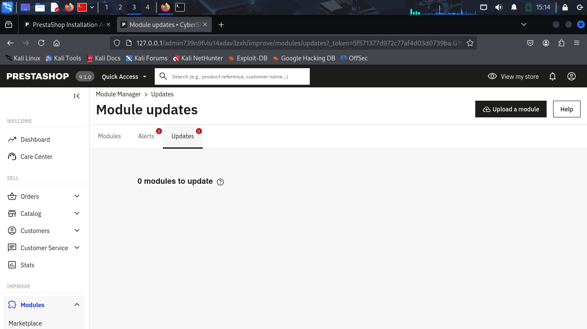

**Outcome:** Reduced exposure to vulnerabilities associated with outdated software components.

---

### 2. Removal of Default Accounts and Sample Data

**Status:** ✅ Implemented

- Reviewed employee accounts.
- Verified only the authorized administrator account existed.
- Reviewed roles and permissions.
- Removed default demo products installed during setup.

#### Evidence

**Employee Account Review**

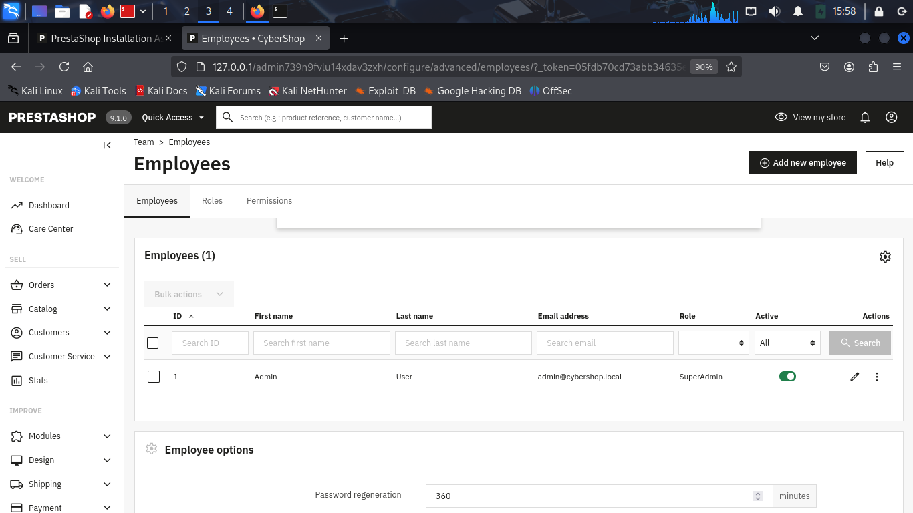

**Roles and Permissions Review**

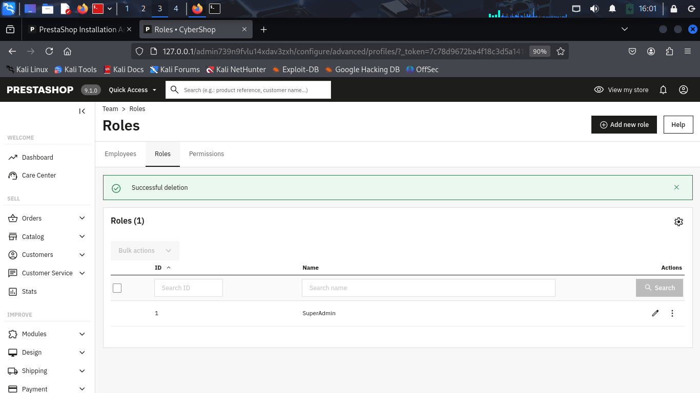

**Demo Products Removed**

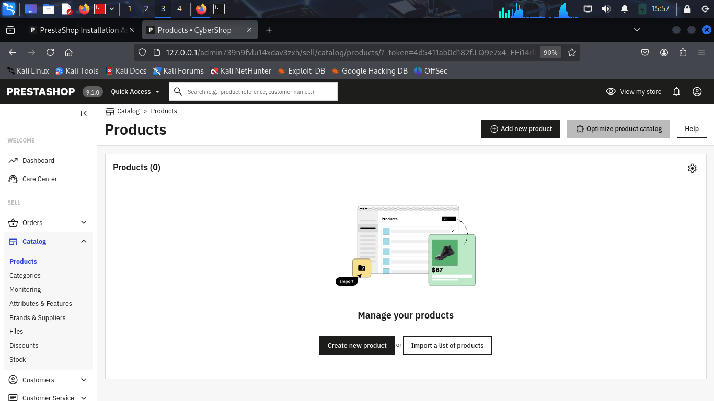

**Outcome:** Reduced unnecessary exposure and removed unused content.

---

### 3. Strong Administrator Password

**Status:** ✅ Implemented

- Replaced a weak password with a strong randomly generated password.
- Password includes:
  - Uppercase letters
  - Lowercase letters
  - Numbers
  - Special characters

#### Evidence

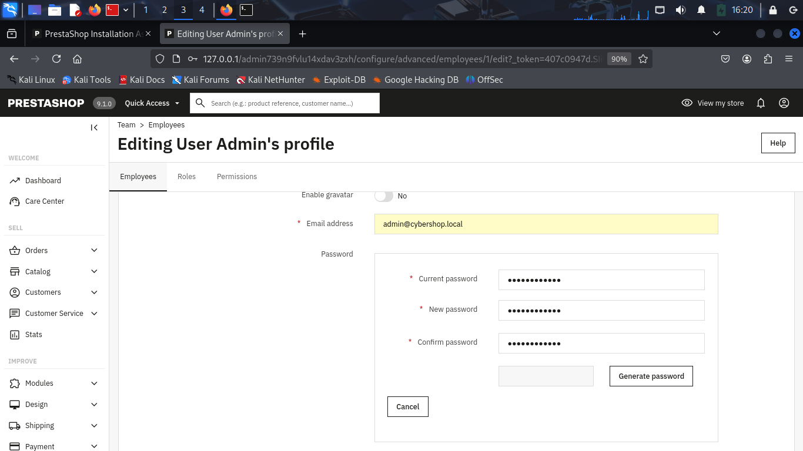

**MFA Review**

Multi-Factor Authentication (MFA) was reviewed but not enabled because additional modules are required.

**Outcome:** Improved resistance against brute-force and password-guessing attacks.

---

### 4. File and Folder Permissions

**Status:** ✅ Implemented

- Reviewed file and folder permissions.
- Confirmed ownership by `www-data`.
- Verified secure permissions:
  - Directories: `755`
  - Files: `644` or `755`
- Disabled Apache directory listing.

#### Evidence

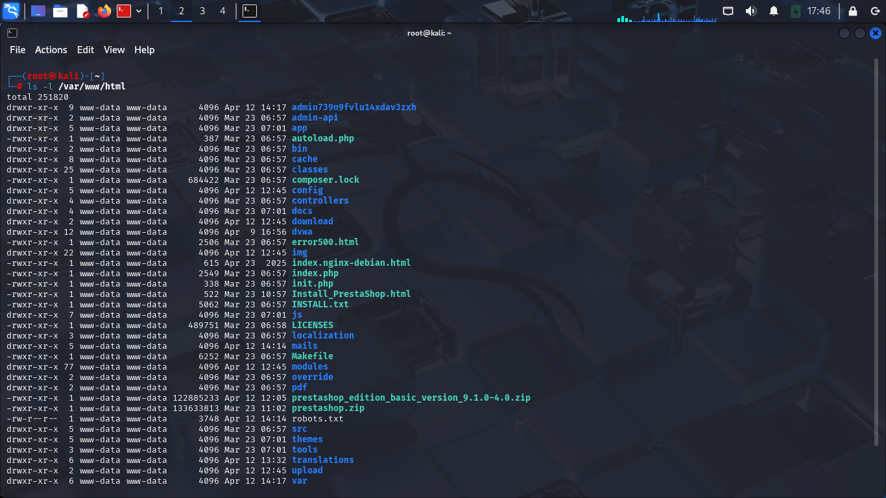

**Outcome:** Reduced risk of unauthorized modifications and information disclosure.

---

### 5. Secure Session Cookie Configuration

**Status:** ✅ Implemented

Verified secure cookie settings:

| Attribute | Status |
|------------|------------|
| HttpOnly | Enabled |
| Secure | Enabled |
| SameSite=Lax | Enabled |

#### Evidence

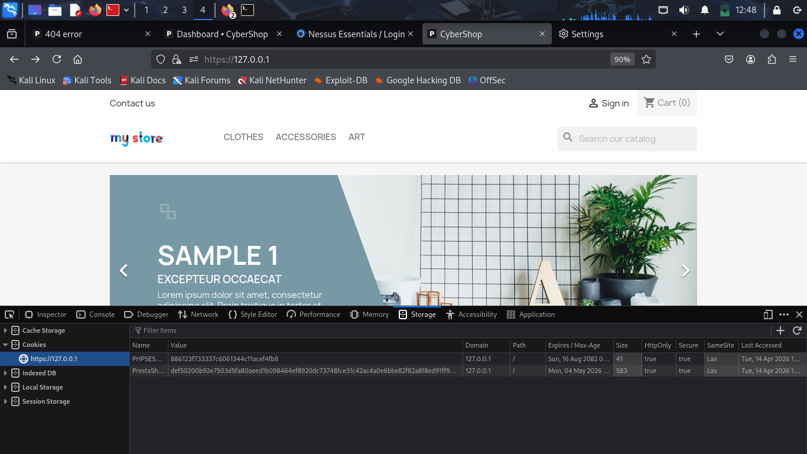

**Outcome**

- Protects against XSS-based cookie theft.
- Ensures cookies are transmitted only over HTTPS.
- Reduces CSRF risks.

---

### 6. Disable Unnecessary Modules

**Status:** ✅ Implemented

Disabled non-essential modules including:

- Google Analytics
- Dashboard statistics modules
- Image Slider
- Wishlist
- Social media integrations
- Marketing modules

#### Evidence

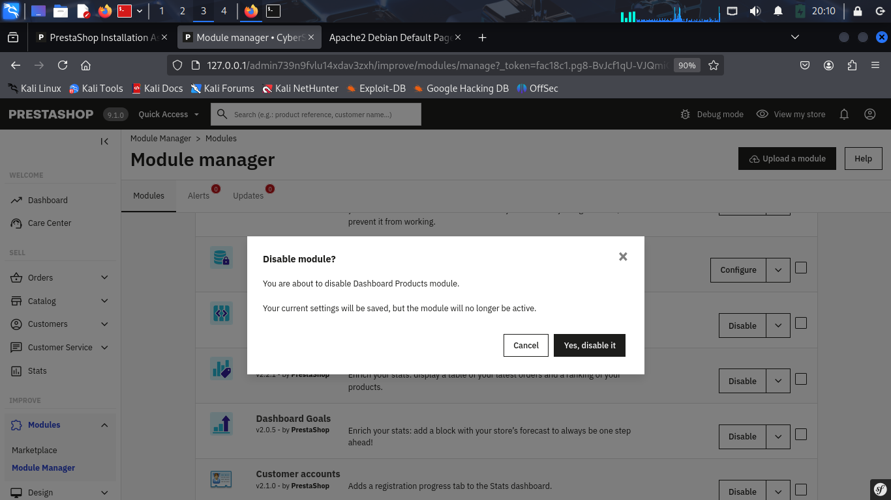

**Outcome:** Reduced attack surface and improved maintainability.

---

### 7. Payment Module Security Review

**Status:** ✅ Implemented

Reviewed active payment modules:

- Cash on Delivery (COD)
- Bank Transfer
- Check Payments
- PrestaShop Checkout

#### Evidence

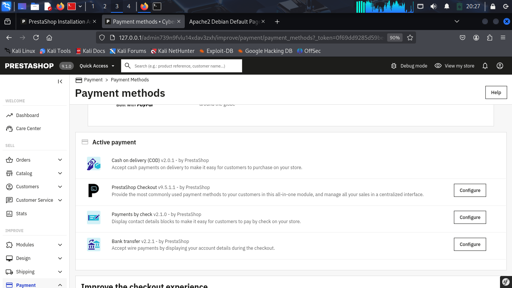

**Findings**

- No insecure payment modules identified.
- Sensitive payment handling delegated to trusted modules.
- HTTPS enforced during checkout.

**Outcome:** Improved payment security and reduced exposure of sensitive data.

---

### 8. TLS Configuration and HTTPS Enforcement

**Status:** ✅ Implemented

- Enabled HTTPS using Apache SSL.
- Verified encrypted communication.
- Confirmed active TLS functionality.

**Note:** A self-signed certificate was used in the testing environment.

#### Evidence

**HTTPS Padlock Verification**

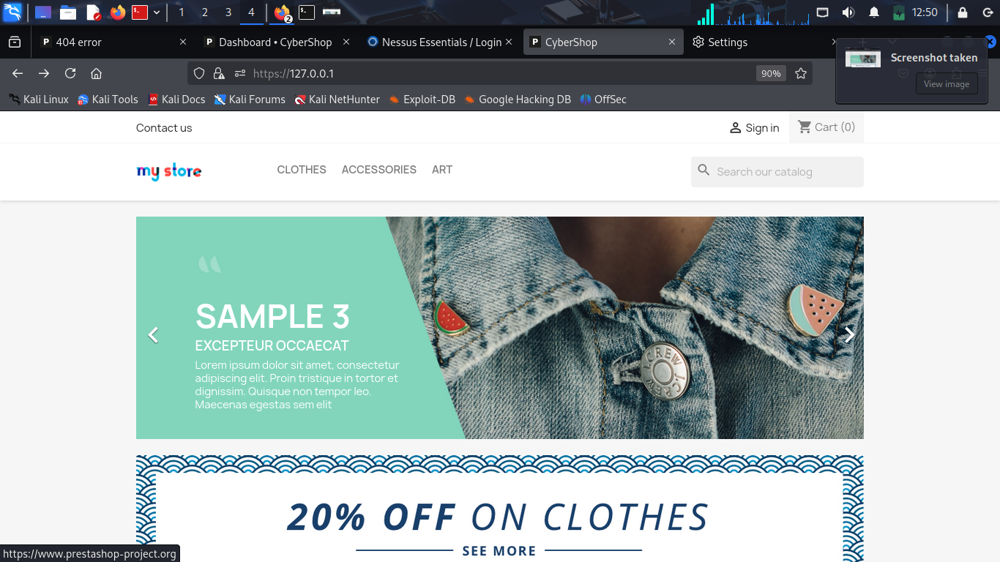

**TLS Enforcement Verification**

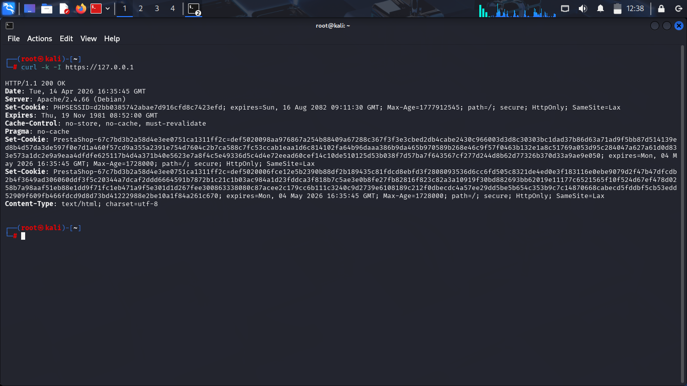

**Outcome:** Protected data in transit through encryption.

---

### 9. Administrative Interface Protection

**Status:** ✅ Implemented

Administrative directory renamed from:

```text
/admin
```

to:

```text
/admin739n9fvlu14xdav3zxh
```

Additional protections:

- Restricted file permissions.
- Reviewed administrative path exposure.
- Applied IP-based access restrictions.

#### Evidence

**Administrative Path Review**

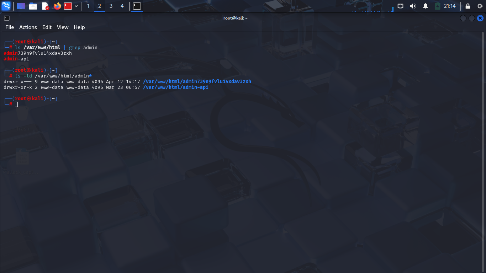

**IP Restriction Applied**

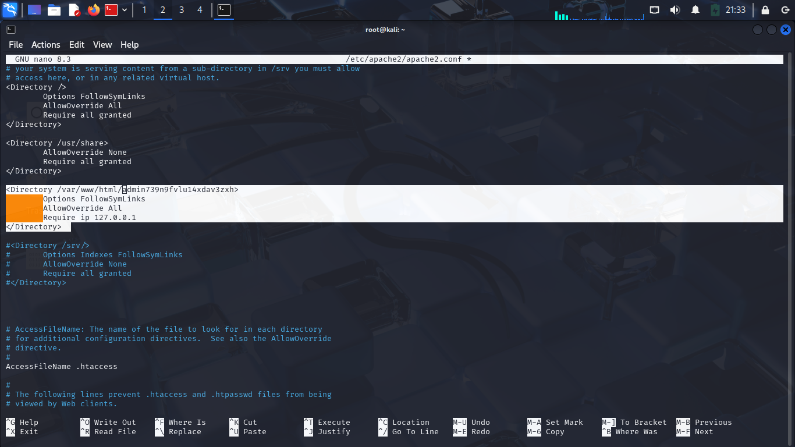

**Outcome:** Reduced risk of brute-force attacks and administrative interface discovery.

---

### 10. Backup and Recovery Verification

**Status:** ✅ Implemented

Backup scope included:

- PrestaShop database
- Application files

Backup tools reviewed:

```bash
mysqldump
```

```bash
tar
```

Recovery procedures were verified to ensure successful restoration.

#### Evidence

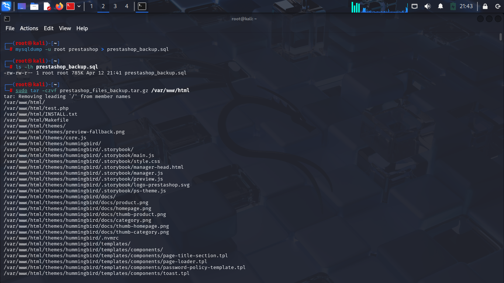

**Outcome:** Improved resilience against data loss and system failure.

---

## Assessment Scope

### In Scope

- PrestaShop 9.1.0 Application
- Administrative Interface
- Session Management
- Payment Modules
- File and Directory Permissions
- HTTPS/TLS Configuration

### Out of Scope

- DVWA
- Other Applications Hosted on Apache
- External Network Services
- Production Systems

## Methodology

The assessment followed a three-phase approach:

### Phase 1: Security Hardening

Implemented:

- Strong administrator credentials
- Secure file permissions
- Administrative path protection
- Module review and reduction
- Secure cookie settings

### Phase 2: Vulnerability Assessment

Assessment focused on:

- HTTP services (Port 80)
- HTTPS services (Port 443)
- PrestaShop application only

Excluded:

- DVWA
- Other hosted applications

### Phase 3: Attack Simulation

Tested:

- Administrative access security
- Session protection
- Configuration exposure
- TLS enforcement

---

## Attack Simulation

### Simulated Attack Vector

The assessment evaluated:

- Administrative path enumeration
- Unauthorized access attempts
- Brute-force attack exposure
- Session hijacking risks
- Configuration weaknesses

### Security Controls Evaluated

The following controls were evaluated during attack simulation:

- Administrative Interface Exposure
- Session Security
- Cookie Protection
- TLS Enforcement
- File Permission Security
- Administrative Path Protection

### Attack Outcome

No unauthorized administrative access was achieved during testing. Implemented hardening controls successfully reduced common attack vectors including administrative enumeration and session-related attacks.

### Results

- Administrative interface successfully protected.
- Unauthorized access attempts denied.
- Secure cookie settings verified.
- HTTPS communication enforced.

---

## Evidence Collected

The assessment evidence included:

- Verification of the installed PrestaShop version.
- Module update validation.
- Employee and role review.
- Demo product removal.
- Administrative password hardening.
- File and folder permission review.
- Secure cookie configuration validation.
- Payment module security review.
- TLS/HTTPS verification.
- Administrative path protection and IP restrictions.
- Backup and recovery verification.

Screenshots demonstrating each control are included throughout this report.

---

## Logs Reviewed

```text
/var/log/apache2/access.log
/var/log/apache2/error.log
```

### Indicators Observed

- HTTP/HTTPS requests
- Administrative access attempts
- PHP warning messages
- Application initialization events

---

## Mitigation Measures Implemented

- Strong administrator passwords
- Administrative path obfuscation
- IP-based access restrictions
- Secure file permissions
- Removal of unnecessary modules
- HTTPS/TLS enforcement
- Secure session cookie configuration
- Backup verification
- Recommendation for Web Application Firewall (ModSecurity)

---

## Security Controls Summary

| Security Control | Status |
|------------------|---------|
| Application Updates | ✅ |
| Demo Data Removal | ✅ |
| Strong Passwords | ✅ |
| Secure Permissions | ✅ |
| Secure Cookies | ✅ |
| Module Hardening | ✅ |
| Payment Security Review | ✅ |
| HTTPS Enforcement | ✅ |
| Administrative Protection | ✅ |
| Backup Verification | ✅ |

---

## Skills Demonstrated

- Web Application Security
- Security Hardening
- Apache Administration
- Linux System Administration
- TLS/HTTPS Configuration
- Access Control Management
- Secure Session Management
- Vulnerability Assessment
- Security Documentation
- Backup and Recovery Planning

## Conclusion

The security hardening and vulnerability assessment demonstrated that the implemented controls significantly improved the security posture of the PrestaShop environment. Administrative access was secured through path obfuscation and access restrictions, transport security was enforced through HTTPS, and session management protections were successfully validated.

The attack simulation confirmed that the implemented safeguards effectively reduced the application's attack surface and improved resilience against common web application threats.

---

## Author

**Eseigbe Ihinosen**

Cybersecurity Enthusiast | Cloud & Security Learner

Project: PrestaShop Security Hardening and Vulnerability Assessment

---

## Disclaimer

This project was conducted in a controlled laboratory environment for educational and cybersecurity training purposes.
